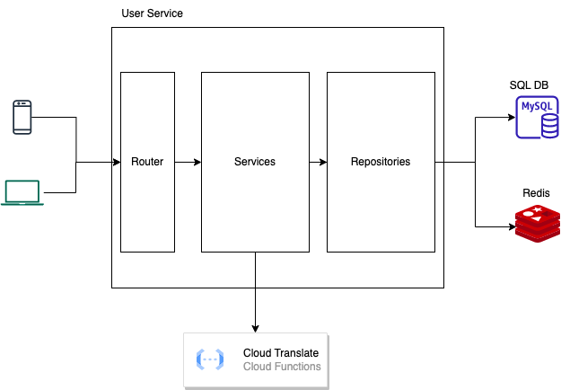

# Wadhwani AI Assignment

-------------------------------------

## Overview

This microservice is system for adding, managing and getting information regarding farmers. The key endpoints include:
- Upload a csv file containing details of users
- Get details of a specific user given their id (autogenerated)
- Get details of the user in a specific language (English, Hindi, Marathi, Telugu, Punjabi)
- Register an auth user
- Login as an auth user to use endpoints.

## Components



- Clients: mobile app or web app 
- User Service microservice: To manage all functionalities regarding user management 
- MySQL: SQL DB to store details on users and auth users 
- Redis: used for caching API requests 
- Cloud Translate: translation APIs for fetching details in specific language.

## Flows

- Register:
  - accepts username and password and inserts them to db.
  - password in encrypted before storing.
- Login:
  - accepts username and password and checks them against the entry in db.
  - generates jwt token if successful.
  - jwt token is used for authorization and authentication of other endpoints.
- Upload User:
  - accepts a file upload (multipart upload) in the request of type csv.
  - parses csv to get users details.
  - stores users details in db.
- Get User:
  - accepts user id in url and language in headers
  - first tries to fetch details from cache.
  - if cache misses, we fetch details from db and hit translation service to get translated details.
  - if cache hits, we send the response as is.

## Assumptions and Considerations

- Caching is used to reduce the number of translation api hits (reduces dependency and cost-efficient)
- All repositories and services have interfaces implemented for easy migration to other dbs/ third party services.
- Passwords are encrypted before storing for data security. Matching is done similarly.
- Upload user and Get user are authenticated APIs, you need a jwt generated via login to access them.

## Setup
```shell
# Install golang
# Install mysql (setup env)
# Install redis (setup env)
# Add google credential files (setup env)

# Install all dependencies in go.mod
go mod download

# Build project
go build user-service

# Run project
./user-service

# Install go-swagger
brew tap go-swagger/go-swagger
brew install go-swagger

# Serve swagger doc (API Documentation)
swagger serve -F=swagger ./docs/swagger.json
```

## Testing
Find the user service collection yaml file in assets/user-service-endpoints.yml

## Improvements

- File Upload can use a file storage system (S3)
  - Separate storage for files
  - pipeline to parse files and send messages to the service to add/update data
- Parallelism
  - Use goroutines and sync groups to parallelize some functionalities (dto, csv parsing)
